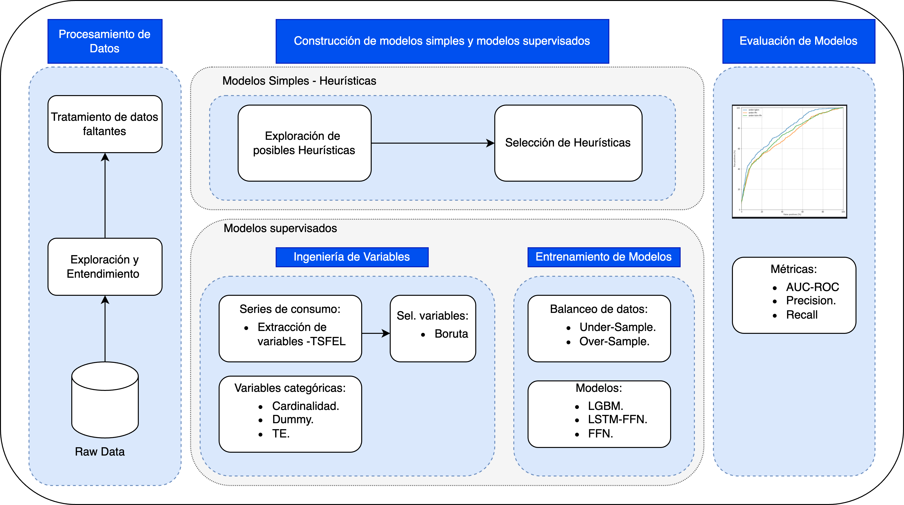
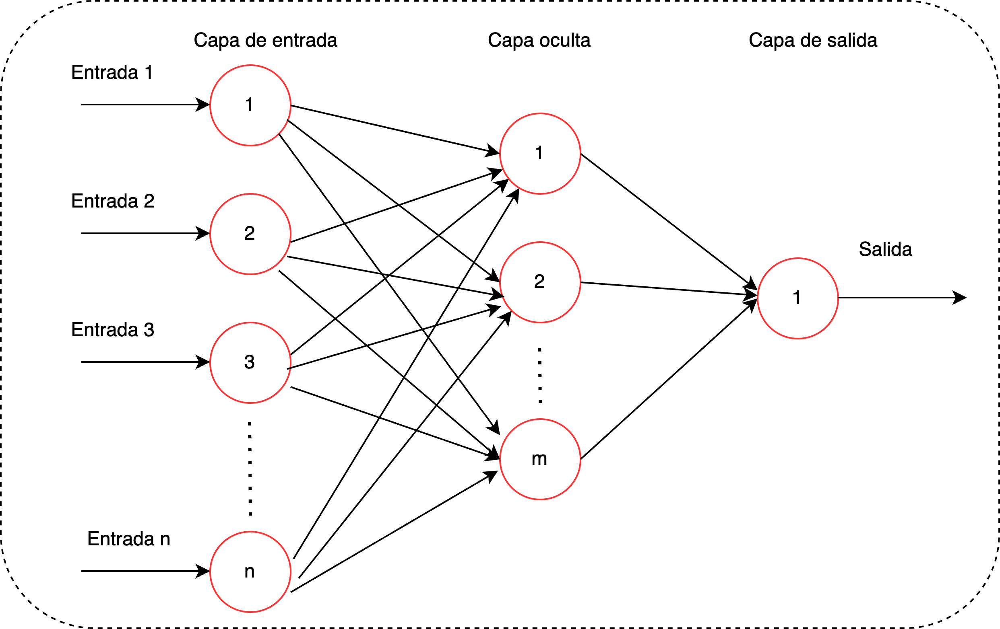
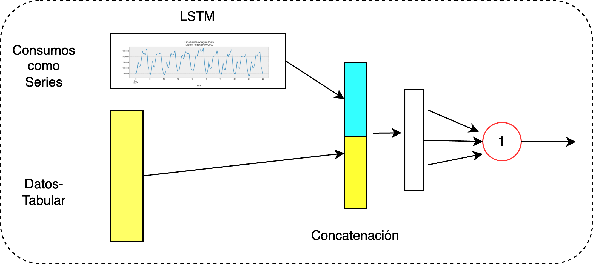
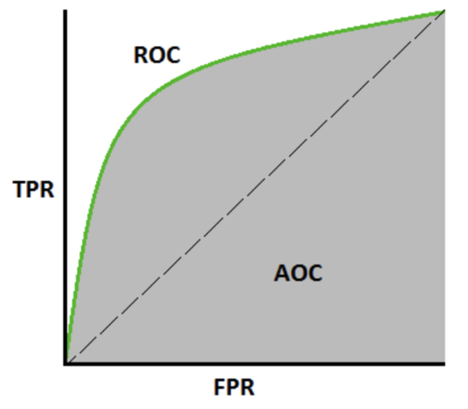

# Overview

Energizados is a machine learning framework for detecting **non-technical losses (NTL)** — electricity theft and meter
fraud — in energy distribution systems.

## The Problem

Non-technical losses represent a significant financial and operational challenge for energy distributors. Detecting
fraudulent users manually is time-consuming and imprecise. Energizados automates this process using machine learning,
reducing regularization time and increasing identification accuracy.

In practice, fraudulent users are rare: **NTL rates typically stay below 10%**, which means working with heavily
imbalanced datasets. Energizados handles this by design.

## Framework Stages

The framework is structured in three sequential stages:

### Stage 1 — Data Preprocessing and Exploration

Raw data is transformed into a meaningful structure for modeling. This stage includes:

- Exploratory data analysis (EDA) to understand distributions, nulls, and outliers
- Identifying useful variables beyond raw consumption (tariff type, economic activity, geographic zone)
- Observing class imbalance between fraudulent and non-fraudulent users

### Stage 2 — Model Construction

Two levels of models are built:

#### Simple (Rule-Based) Models

Analytical rules derived from domain expertise and EDA:

- **Consumption drop**: Detects users whose current consumption dropped dramatically compared to prior periods
- **Constant consumption**: Identifies users with suspiciously flat consumption over extended periods

These serve as interpretable baselines.

#### Supervised Models

More complex models trained on labeled data:

1. **Feature Engineering**: Derives new variables from the 12-month consumption series:
    - *Statistical*: max, mean, min, median, std
    - *Spectral*: signal slope, signal variance, signal distance
    - *Temporal*: autocorrelation, entropy, centroids

2. **Feature Selection**: Removes constant, highly correlated, or irrelevant features (Boruta, correlation, constant variance, categorical, mutual information)

3. **Imbalanced data handling**: Under-sampling or over-sampling strategies (imbalanced-learn)

4. **Hyperparameter optimization**: Random Search over configurable parameter grids

5. **Models available**:

**LightGBM** — A gradient boosting model that builds an ensemble of decision trees iteratively: each new tree focuses on the cases where the previous one performed worst. It is fast, memory-efficient, and handles missing values natively.

**Feedforward Neural Network** — A multilayer network where all signals flow in one direction (input → hidden layers → output). Each neuron is connected to the next layer via learnable weights. The inputs are preprocessed categorical features concatenated with row-scaled consumption values.

**LSTM + Feedforward** — Combines a recurrent LSTM branch (which processes the 12-month consumption series as a sequence, retaining temporal memory) with a dense branch for categorical features. Both branches are concatenated before the output layer.

**CatBoost** — Gradient boosting with native support for categorical features, no manual encoding required.

**XGBoost** — Gradient boosting (sklearn-compatible) with strong tabular accuracy. Optional dependency: install with `pip install energizados[xgboost]`.

**Ensemble** — Combines multiple base models via soft voting (weighted average of probabilities) or stacking (a meta-learner trained on base model predictions).

### Stage 3 — Model Evaluation

Trained models are evaluated on held-out data. The primary metric is **AUC-ROC**:

- Measures a model's ability to separate fraudulent from non-fraudulent users across all classification thresholds
- A higher AUC means the model is better at ranking fraudulent users above legitimate ones
- Formally: `TPR = TP / (TP + FN)` vs `FPR = FP / (FP + TN)` across thresholds

Additional metrics: precision, recall, F1, confusion matrix, cumulative gains curve.

- SHAP-based model explainability (summary + bar plots) for regulatory compliance

## Sample Dataset

New projects created with `energizados init` include a real anonymized dataset for immediate testing:

| Property         | Value  |
|------------------|--------|
| Records          | 42,500 |
| Columns          | 19     |
| Fraudulent users | ~5.8%  |

**Column descriptions:**

| Variable                       | Description                                 | Type        | Cardinality |
|--------------------------------|---------------------------------------------|-------------|-------------|
| `1_anterior` ... `12_anterior` | Monthly energy consumption (last 12 months) | Numeric     | —           |
| `actividad`                    | User's economic activity                    | Categorical | 284         |
| `tipo_tarifa`                  | Billing tariff type                         | Categorical | 47          |
| `nivel_tension`                | Installed voltage level                     | Categorical | 18          |
| `material_instalacion`         | Meter material type                         | Categorical | 39          |
| `zona`                         | Geographic zone                             | Categorical | 38          |
| `target`                       | Fraudulent (1) or non-fraudulent (0)        | Binary      | 0–1         |
| `fecha_inspeccion`             | Inspection date                             | Date        | —           |

---

[Installation →](installation.md)
